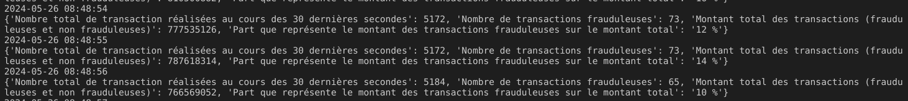
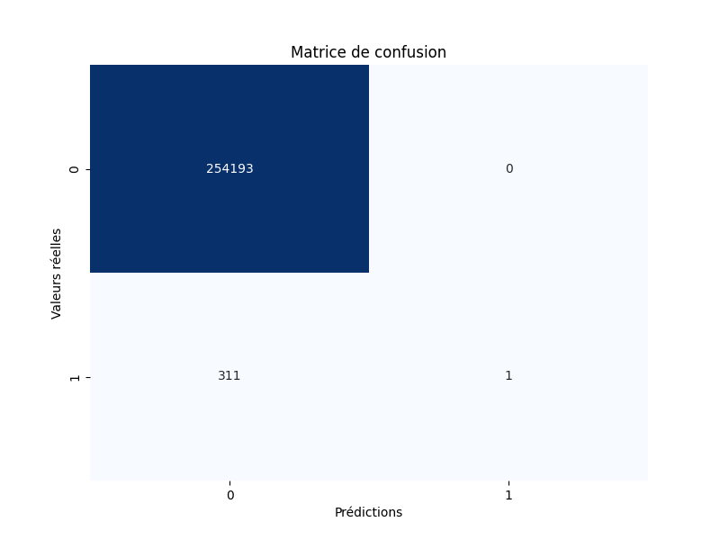
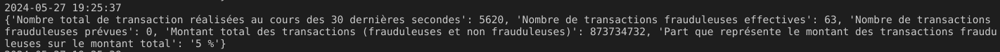

<div align="center">

  <h2 align="center">Détection des anomalies de flux financiers avec Apache Kafka</h2>

<div align="center"></div>


<h2 align="center">François Legland</h2>
</div>

## À propos du projet

### Description

Une grande banque en ligne souhaite améliorer sa réactivité face aux transactions frauduleuses afin de servir au mieux ses clients. Pour cela, elle souhaite donc détecter en temps réel les transactions frauduleuses qui pourraient survenir sur les comptes de ses clients.

Dans son système, l'entreprise enregistre toutes les transactions dans une base de données. Après réflexions au sein de l'équipe technique, l'entreprise a décidé d'utiliser Apache Kafka pour y stocker toutes les transactions financières en temps réel de ses clients. Elle souhaite donc pouvoir utiliser ce système afin d'effectuer des analyses en temps réel et faire remonter les potentielles transactions frauduleuses.

En tant que Data Engineer, il vous est demandé de mettre en place un consumer qui puisse analyser toutes les transactions en temps réel et faire remonter les transactions potentiellement frauduleuses. Afin d'aider les Data Scientists à calibrer un modèle de Machine Learning qui puisse identifier les transactions frauduleuses, l'entreprise utilise des robots qui ajoutent artificiellement des fraudes dans les données.

### Contraintes


* L'algorithme de détection doit être en mesure de pouvoir supporter jusqu'à une moyenne de 500 transactions par seconde.
* Ce dernier doit être déployé et s'exécuter en continu dans le Cloud (machine virtuelle ou serverless type Cloud Run sur GCP).

### Données

Les données envoyées par le producer sont au format suivant.

```json
{
   "step":1,
   "type":"PAYMENT",
   "amount":6990.18,
   "nameOrig":"C1101721002",
   "oldbalanceOrg":60911.31,
   "newbalanceOrig":53921.13,
   "nameDest":"M809128217",
   "oldbalanceDest":0.0,
   "newbalanceDest":0.0,
   "isFraud":0
}
```

* `step` est une variable de référence utilisée pour la génération de données.
* `type` contient le type de transaction (débit, crédit, transfert entre deux comptes, retrait en espèces).
* `amount` est le montant de la transaction.
* `nameOrig` est le nom du compte d'origine de la transaction.
* `oldbalanceOrg` est le solde avant la transaction du compte d'origine d'où émane la transaction.
* `newbalanceOrig` est le solde après la transaction du compte d'origine d'où émane la transaction.
* `nameDest` est le nom du compte de destination de la transaction.
* `oldbalanceDest` est le solde avant la transaction du compte de destination vers lequel la transaction est effectuée.
* `newbalanceDest` est le solde après la transaction du compte de destination vers lequel la transaction est effectuée.
* `isFraud` indique si la transaction est une transaction frauduleuse généré artificiellement.

## Étapes de réalisation

### 1. Clôner le dépôt

Un dépôt git a été créé à l'occasion du projet. On commence par le clôner en local.

```shell
git clone https://github.com/FrancLgd/PUBLIC-Projet-Detection-anomalie-Kafka.git
cd PUBLIC-Projet-Detection-anomalie-Kafka
```

### 2. Lancer le producer

Au prélable, on installe (ici dans un environnement `venv`) les dépendances Python dont nous allons avoir besoin.

```shell
python3 -m venv venv
source venv/bin/activate
# pip install pandas time json kafka-python pyarrow fastparquet scikit-learn matplotlib seaborn
# pip freeze > requirements.txt
pip install -r requirements.txt
```

Une fois les dépendances installées, on peut alors exécuter le producer Python dans une console indépendante.

```shell
python ./src/producer.py
```

### 3. Construire un consumer pour analyser les transactions

Nous créons ici un consumer qui soit en mesure d'intercepter les messages envoyés par le producer sur le topic `transactions`.

En l'occurrence, les statistiques suivantes sont calculées sur des périodes de 30 secondes (fenêtre glissante/rafraîchissement toutes les secondes):
* nombre de transactions réalisées au cours des 30 dernières secondes
* nombre de transactions frauduleuses au cours des 30 dernières secondes
* montant total des transactions (frauduleuses et non frauduleuses)
* part que représente le montant des transactions frauduleuses sur le montant total

Ce consumer est définit dans `./src/analysis_consumer.py`.

En l'exécutant, nous obtenons une log de ce type :



### 4. Calibrer un modèle de régression logistique

La commande suivante permet de lancer l'entraînement d'un modèle logistique pour la détection des transactions frauduleuses. 

```shell
python ./src/train_fraud_detector.py
```

Le modèle généré est sauvegardé sous `./data/modele_logistique.pkl`.

L'entraînement est réalisé sur une fraction des données présentes dans `./data/transactions.parquet` (20% en l'occurence, cf. le paramètre `FRAC_RATIO`). 

Les variables explicatives utilisées sont *oldbalanceOrg*, *oldbalanceDest*, *type*, et *amount*, avec un One Hot Encoding des variables catégorielles. 

Le modèle est évalué par validation croisée en laissant une partie des données extraites dans un échantillon de test (avec un ratio train/test de 80%-20%, cf. paramètre `TEST_RATIO`). La matrice de confusion obtenue est donnée par l'image ci-dessous.



Nous y observons que les cas de transactions frauduleuses sont proportionnellement très faibles, et qu'en l'état le modèle arrive mal à les détecter. En effet ici, parmi les 312 fraudes du jeu de test, seul une a bien été détectée par le modèle.

Si en conditions réelles le modèle de détection n'apporte pas de performance satisfaisante et mériterait d'être amélioré, nous nous contenterons dans ce projet démonstrateur de l'utiliser tel quel.

### 5. Détecter en temps réel les cas de fraude

Nous ajoutons à notre consumer défini partie 3. la capacité de prévoir les faudres en utilisant notre modèle précédemment entraîné.

La nouvelle version du code ainsi obtenue se trouve alors dans `./src/analysis_consumer_vdetector.py`. 

Nous donnons ci-dessous un exemple de la nouvelle log :



### 6. Déployer le consumer dans le Cloud

Le consumer est enfin déployé dans le cloud (sur Google Cloud Functions) à l'aide de la commande suivante :

```shell
gcloud functions deploy main --runtime python310 --trigger-http --allow-unauthenticated --entry-point main --source ./analysis_consumer_vdetector.py
```
